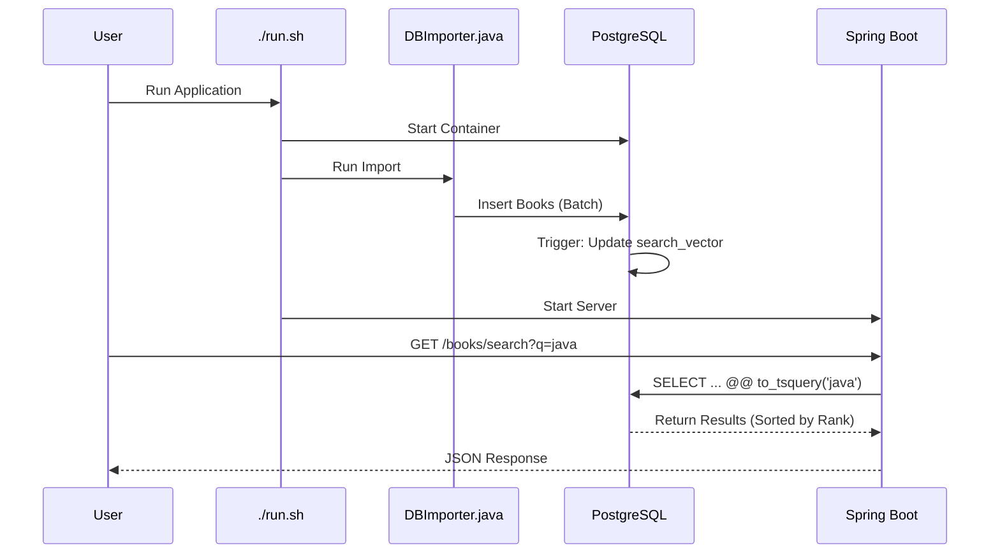

# Book Search Project - Architectural Decisions & README

## Project Overview
This project is a Spring Boot application that provides a search API for a library of books. It uses PostgreSQL as the backing database and includes features like full-text search.

## Architectural Decisions

### 1. Unified Data & Search Platform (PostgreSQL)
I strategically selected **PostgreSQL 17** to serve as both the primary system of record and the search engine. This decision invalidates the need for a separate search infrastructure (like Elasticsearch) for this scale, significantly reducing operational complexity and cost.

#### Rationale
- **Hybrid Capability**: PostgreSQL's native support for **Full-Text Search** (via `tsvector` and `GIN` indexes) provides "good enough" relevance and sub-millisecond query performance for datasets under 10M records. This allows me to avoid the "dual-write" problem of syncing a primary DB with a search index.
- **ACID Compliance**: Unlike many NoSQL alternatives, PostgreSQL guarantees strict ACID compliance. For a library system, transactional integrity (e.g., ensuring a book isn't checked out by two people simultaneously) is non-negotiable.
- **Relational Integrity with Flexibility**: I leverage the relational model for strict consistency on metadata (Books <-> Authors) while utilizing PostgreSQL's extensibility (Triggers/Functions) to handle derived data like search vectors automatically.
- **Schema Design with Normalization**:
    - **Authors & Books**: Decoupled into `3NF` (Third Normal Form) to prevent data anomalies. A book can have multiple authors, and an author can write multiple books; a many-to-many relationship `books_authors` correctly models this reality while enabling efficient JOINs.
    - **Performance Optimizations**:
        - `SERIAL` IDs for fast B-Tree indexing on primary keys.
        - `TEXT` types over partial `VARCHAR` to avoid arbitrary truncation limits, relying on TOAST storage for large fields.

### 2. Data Ingestion Strategy
Initially, I attempted a raw SQL `COPY` command. However, I migrated to a custom **Java-based Importer (`DBImporter.java`)** for several reasons:
- **Resilience**: SQL `COPY` failed on dirty data (e.g., long descriptions). Java allows me to handle exceptions gracefully.
- **Flexibility**: I needed to generate `books_authors` relationships dynamically, which is complex to do with raw CSV imports in SQL.
- **Control**: Explicitly fetching IDs and handling `ON CONFLICT` logic was cleaner in Java code.

### 3. Full-Text Search Implementation
Instead of relying on basic `LIKE` queries which are slow and inaccurate, I implemented **PostgreSQL Native Full-Text Search**.
- **Implementation**: Added a `tsvector` column `search_vector` to the `books` table.
- **Automation**: Created a database `TRIGGER` (`books_search_vector_update`) to automatically update the search vector whenever a book record is inserted or modified. This eliminates the need for manual maintenance scripts.
- **Performance**: Added a `GIN` index to `search_vector`, making search operations extremely fast even on large datasets.

### 4. Robust Backend Architecture
I transitioned from a simple script-based approach to a fully **Strictly-Typed Layered Architecture**:
- **Strict Schema Enforcement**: I refactored the database schema to use precise types (`BIGINT` types for IDs, `NUMERIC` for financials, `DATE` for calendar dates, and `TEXT` for potentially unlimited strings). This moves data validation to the database layer, preventing "silent failures" or data corruption that comes with generic `VARCHAR` usage.
- **Layered Application Design**:
    - **Controller Layer (`BookController`)**: Handles HTTP concerns and input validation.
    - **Service Layer (`BookService`)**: Encapsulates business logic, ensuring code is reusable and testable (demonstrated by `BookServiceTest`).
    - **Repository Layer (`BookRepository`)**: Abstraction over data access. I use Spring Data JPA's `@Query` to execute native PostgreSQL full-text search syntax (`@@ to_tsquery`) while returning strongly-typed `Book` entities.

## How to Run

### Prerequisites
- Java 21+
- Maven
- Docker Desktop

### Quick Start
The easiest way to run the application is using the provided helper script:

```bash
./run.sh
```

This script will:
1. Check for Docker availability.
2. Free up port 8080 if needed.
3. Start the PostgreSQL database container.
4. Run the Data Importer to ensure your database is populated.
5. Launch the Spring Boot application.

### Manual Steps
1. **Start Database**: `docker compose up -d`
2. **Import Data**: `mvn clean compile exec:java -Dexec.mainClass="com.h2.DBImporter"`
3. **Run App**: `mvn spring-boot:run`

## Access Points
- **Search API**: `GET http://localhost:8080/books/search?searchTerm=algorithms`
- **Application Root**: http://localhost:8080
- **PgAdmin**: http://localhost:5050 (Credentials: `admin@admin.com` / `admin123`)

## 👨‍💻 For Junior Developers: Learning Guide

If you are new to this codebase, here is a breakdown to help you navigate and understand the "Why" behind the code.

### 📂 Project Structure
```
book-search/
├── db/
│   ├── create_schema.sql  # The Blueprint. Defines tables, types, and indexes.
│   └── load_data.sql      # (Legacy) Old SQL script, replaced by DBImporter.
├── src/main/java/com/h2/
│   ├── controller/        # API Layer. The "Front Desk" that accepts requests.
│   ├── service/           # Logic Layer. The "Worker" that processes requests.
│   ├── repository/        # Data Layer. The "Librarian" that fetches books.
│   ├── entity/            # Models. Java representation of the DB tables.
│   └── DBImporter.java    # Data Loader. Unique script to parse CSV & load DB.
└── run.sh                 # Automation. One-click setup script.
```

### 🧠 Key Concepts & Files to Study

1.  **Strict Typing for Safety**:
    *   Look at `Book.java` and `create_schema.sql`. Notice how I match `BigDecimal` in Java with `NUMERIC` in SQL. This prevents rounding errors with prices!
    *   *Challenge*: Try changing `price` to `string` in `Book.java` and see what happens (Spoiler: It breaks, which is good!).

2.  **Full-Text Search (FTS)**:
    *   **SQL Side**: Check `create_schema.sql`. Look for `tsvector` and the `GIN` index. This is the search engine magic.
    *   **Java Side**: Open `BookRepository.java`. See the `@Query`. I use native SQL (`@@ to_tsquery`) because JPA doesn't support this specific feature out of the box.

3.  **Batch Processing**:
    *   Open `DBImporter.java` and search for `.addBatch()`.
    *   **Why?** Sending 1000 inserts in 1 network packet is much faster than sending 1 insert 1000 times. This is critical for performance.

4.  **Dependency Injection (DI)**:
    *   Notice `@Autowired` in `BookController`. Spring automatically gives the controller the `BookService` it needs. You don't see `new BookService()` anywhere. This makes testing easier.

### 🗺️ Architecture & Data Flow


### 🛠 Useful Commands
*   **Run Unit Tests**: `mvn test` - Runs all the tests in `src/test`. Use this before pushing code!
*   **Check Database Logs**: `docker compose logs -f library-db` - See what PostgreSQL is doing in real-time.
*   **Rebuild & Clean**: `mvn clean install` - Deletes old build files and compiles everything fresh.

### ❓ Troubleshooting (Common Issues)
*   **"Port 8080 matches... already in use"**:
    *   *Solution*: The script tries to fix this, but if it fails, run `lsof -i :8080` to find the process ID and `kill -9 <PID>` to stop it.
*   **"Connection refused"**:
    *   *Solution*: Ensure Docker is running (`docker ps`). The database container might be stopped.
*   **"Value too long" Error**:
    *   *Solution*: This happened before! I fixed it by changing columns to `TEXT`. Always check your schema (`create_schema.sql`) against your data.
